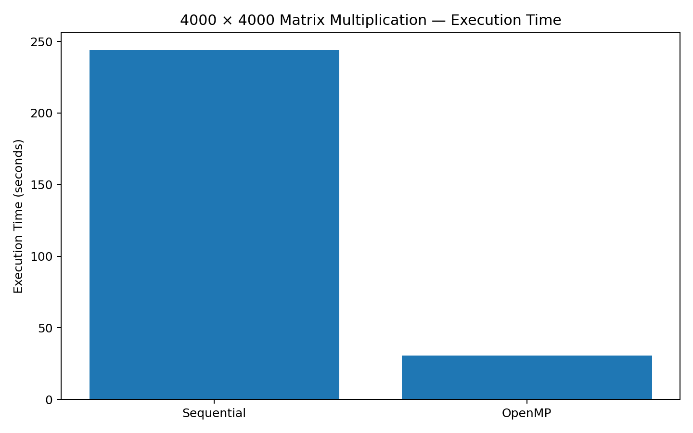

# Experiment 1 — Sequential Matrix Multiplication

## Aim
To implement 4000 × 4000 matrix multiplication using a sequential CPU execution model and record the execution time as the baseline for parallel implementations.

## Problem Definition
- Matrix A: 4000 × 4000
- Matrix B: 4000 × 4000
- All elements of A and B are initialized to `1.0`
- Result: `C = A × B`
- Expected verification: `C[0][0] = 4000.00`

## Concept
The sequential implementation performs the complete matrix multiplication using a single CPU execution flow. It provides the baseline for comparing parallel implementations.

## Algorithm

```text
For i = 0 to N-1
    For j = 0 to N-1
        For k = 0 to N-1
            C[i][j] += A[i][k] × B[k][j]
```

## Source File

`mat.c` / `matrix_sequential.c`

## Compilation

If using Linux/WSL:

```bash
gcc -O2 matrix_sequential.c -o matrix_sequential
```

If using the current Windows file `mat.c`:

```powershell
gcc -O2 mat.c -o mat.exe
```

## Execution

Linux/WSL:

```bash
./matrix_sequential
```

Windows PowerShell:

```powershell
.\mat.exe
```

## Reference Result

The lab manual records the following reference result:

| Parameter | Value |
|---|---:|
| Matrix Size | 4000 × 4000 |
| Execution Time | 244.120000 s |
| Verification | 4000.00 |

## Expected Output

```text
Sequential Matrix Multiplication Completed
Matrix Size = 4000 x 4000
Execution Time = ... seconds
Verification C[0][0] = 4000.00
```

## Performance Graph



*The graph uses the reference execution time reported in the lab manual.*

## Conclusion

The sequential implementation successfully performs the complete 4000 × 4000 matrix multiplication and provides the baseline execution time for comparison with OpenMP, MPI and CUDA implementations.
