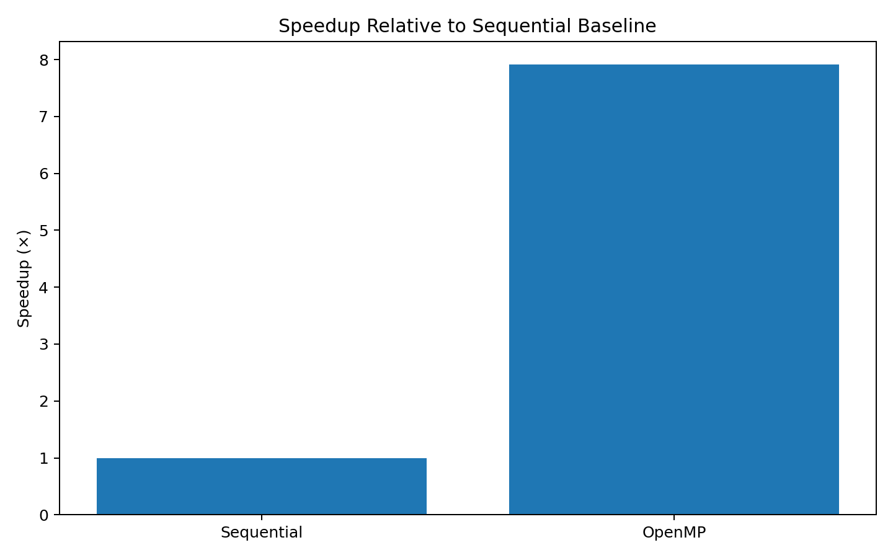

# Experiment 2 — OpenMP Matrix Multiplication

## Aim
To parallelize the 4000 × 4000 matrix multiplication using OpenMP shared-memory parallelism and compare its execution time with the sequential baseline.

## Problem Definition
- Matrix A: 4000 × 4000
- Matrix B: 4000 × 4000
- All elements are initialized to `1.0`
- Result: `C = A × B`
- Expected verification: `C[0][0] = 4000.00`

## Concept

OpenMP uses multiple threads on the same shared-memory machine. The matrix multiplication algorithm remains the same, but the outer loop is divided among multiple CPU threads.

Main directive:

```c
#pragma omp parallel for private(j, k)
```

## Source File

`mat_openmp.c` / `matrix_openmp.c`

## Thread Configuration

Reference configuration from the lab manual:

```bash
export OMP_NUM_THREADS=8
```

Verify:

```bash
echo $OMP_NUM_THREADS
```

Expected:

```text
8
```

## Compilation

```bash
gcc -O2 -fopenmp matrix_openmp.c -o matrix_openmp
```

The `-fopenmp` option enables OpenMP support.

## Execution

```bash
./matrix_openmp
```

To monitor CPU utilization during execution:

```bash
htop
```

## Reference Result

| Parameter | Value |
|---|---:|
| Matrix Size | 4000 × 4000 |
| Threads | 8 |
| Execution Time | 30.830434 s |
| Verification | 4000.00 |
| Speedup | 7.92× |

## Expected Output

```text
OpenMP Matrix Multiplication Completed
Matrix Size = 4000 x 4000
Number of Threads Used = 8
Execution Time = ... seconds
Verification C[0][0] = 4000.00
```

## Performance Graphs

### Execution Time


### Speedup



## Speedup Calculation

```text
Speedup = Sequential Execution Time / OpenMP Execution Time

        = 244.120000 / 30.830434

        ≈ 7.92×
```

## Sequential vs OpenMP

| Feature | Sequential | OpenMP |
|---|---|---|
| Execution model | Single CPU execution flow | Multiple CPU threads |
| Memory model | Single execution flow | Shared memory |
| Parallelism | No | Yes |
| Reference time | 244.120000 s | 30.830434 s |
| Verification | 4000.00 | 4000.00 |

## Conclusion

OpenMP keeps the same matrix multiplication algorithm while distributing outer-loop iterations among multiple CPU threads. In the lab manual's reference run, OpenMP reduced the execution time from 244.120000 seconds to 30.830434 seconds, corresponding to a calculated speedup of approximately 7.92×.
